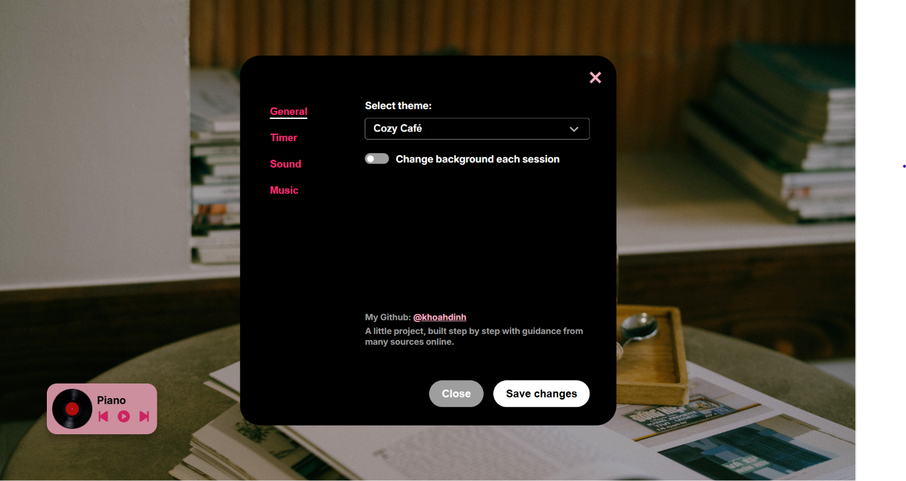
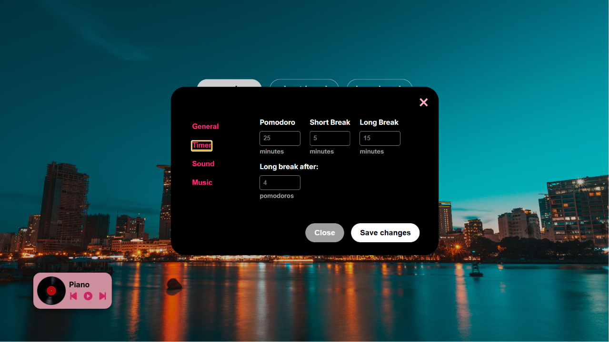

# 🌸 In The Mood For Study

A desktop productivity app — Pomodoro timer, music player, and ambient sounds, all wrapped in a soft pink-black aesthetic.

Built with Electron and vanilla JavaScript, as a way to actually _learn_ JS by shipping something real — not just another to-do list tutorial clone.





## ✨ Features

- **⏱️ Pomodoro Timer** — fully customizable focus/break intervals, auto long break after N rounds, live progress
- **🎵 Music Player** — upload your own MP3s, build a playlist, vinyl record that actually spins (and decelerates like a real one when paused)
- **🔔 Ambient Sounds** — built-in sound options with live preview and independent volume control
- **🖼️ Background Switcher** — pick from a built-in image library, applied instantly
- **🌸 Vintage UI** — pink-black theme, cafe conner backdrop, no design system shortcuts

## 🛠️ Tech Stack

- **Electron** — desktop shell
- **HTML / CSS / Vanilla JavaScript** — no frameworks, on purpose (this project is the framework-learning step before frameworks)
- **localStorage** — settings persistence
- **electron-builder** — packaging into a Windows installer

## 🚀 Getting Started

**Just want to try the app?**
Grab the latest installer from [Releases](../../releases) — download, run, done.

**Want to run it from source?**

```bash
git clone https://github.com/khoahdinh/in-the-mood-for-study.git
cd in-the-mood-for-study
npm install
npm start
```

**Want your own installer?**

```bash
npm run dist
```

The packaged `.exe` will show up in `dist/`.

## ⚠️ Known Limitations

- **Uploaded playlists don't survive a restart.** Uploaded tracks use temporary blob URLs (`URL.createObjectURL`), which die with the session — they're never written to disk. The correct fix is routing uploads through Electron's IPC to copy files into `app.getPath("userData")`. Flagged here instead of quietly ignored, because pretending a limitation doesn't exist is worse than naming it.

## 📝 Lessons Learned

- **Cutting scope is a feature, not a failure.** Shuffle, drag-and-drop playlist reordering, and a couple of other nice-to-haves got cut deliberately — not because they were hard, but because they weren't worth the complexity for this app's actual use case.
- **Naming a limitation beats hiding it.** The blob-URL playlist issue could've been quietly ignored. Writing it down, plus the correct fix (IPC), felt more honest than pretending the app was 100% done.
- **Reasoning through bugs beats memorizing fixes — but it's worth doing it faster.** Working through this project, the pattern that stood out most was preferring to _understand_ a bug (why two animation loops fight over the same variable, why a blob URL dies on restart) over just pasting a fix. That's the right instinct for actually learning. The next level up is trusting that instinct enough to reason through the first guess with more confidence, instead of double-checking every step before committing to it.

## 📄 License

ISC

## 🙋 Author

## 🙋 Author

**khoahdinh** — built this while learning JavaScript and Electron from scratch.
Feedback and bug reports welcome via [Issues](../../issues).
