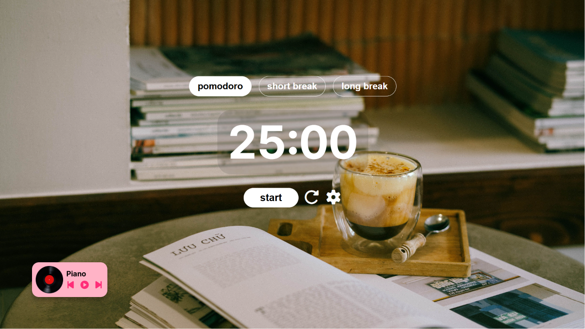
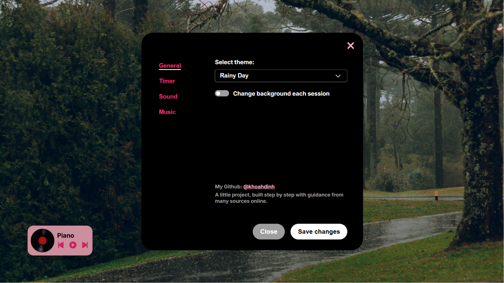

# 🎧 In The Mood For Study

A minimalist desktop Pomodoro timer and music player, built with Electron and vanilla JavaScript. Designed to help you focus — no browser tabs, no distractions, just a timer, a playlist, and you.


---

## ✨ Features

### ⏱️ Pomodoro Timer

- Full pomodoro cycle: **study → short break → long break** (after N rounds)
- Fully customizable intervals — set your own study/break lengths and round count
- Robust timer logic that handles settings changes mid-session without breaking the cycle count

### 🔊 Sound

- Multiple notification sounds to choose from
- Real-time preview when selecting a sound
- Independent volume control for notification sounds
- Sound plays automatically on timer completion

### 🎵 Music Player

- Upload your own MP3 files to build a custom playlist
- Add and remove tracks from the playlist
- Play / Pause / Next / Previous controls
- Auto-advances to the next track when one ends
- Smooth, physically-animated vinyl record UI that spins while playing and gradually decelerates when paused

### ⚙️ Settings

- Centralized settings panel with tabs: **General, Timer, Sound, Music**
- Changes are validated before saving

---

## 🖼️ Screenshots




---

## 🛠️ Built With

- **[Electron](https://www.electronjs.org/)** — desktop app shell
- **HTML / CSS / Vanilla JavaScript** — no frameworks
- **localStorage** — local data persistence
- **[Font Awesome](https://fontawesome.com/)** — icons
- **[Inter](https://rsms.me/inter/)** — typeface (loaded locally)
- **electron-builder** — packaging into a Windows installer (NSIS)

---

## 📦 Installation

### Run from source

```bash
git clone https://github.com/khoahdinh/<repo-name>.git
cd <repo-name>
npm install
npm start
```

### Download the installer

Grab the latest `.exe` from the [Releases](../../releases) page and run the installer. No additional setup required.

---

## ⚠️ Known Limitations

- **Uploaded playlist doesn't persist across app restarts.** Tracks are loaded using blob URLs, which are only valid for the current app session — closing and reopening the app will clear your playlist. The correct fix is to copy uploaded files into the app's user data folder via Electron's IPC (renderer → main process) instead of relying on blob URLs. This is a planned improvement for a future version.
- **Background image customization is not yet implemented.** The General settings tab is currently a placeholder for this feature.
- **Study streak tracking is not yet implemented.**
- Settings for Timer and Sound are not yet saved to `localStorage` — they currently reset to defaults on app restart. (Note: this is unaffected by the blob URL issue above and is a straightforward addition planned next.)

---

## 🚧 Roadmap

- [ ] Persist Timer and Sound settings via `localStorage`
- [ ] Implement IPC-based file persistence for uploaded music (fix playlist reset on restart)
- [ ] Build out background image feature (built-in library + custom image import)
- [ ] Build study streak tracker with heatmap and stats
- [ ] Add Dark / Light / Auto theme mode

---

## 📚 What I Learned

This was my first project working outside of C/C++ and DSA, and my first time building a real desktop application. A few of the bigger lessons:

- **Asynchronous thinking.** Coming from C/C++, I was used to blocking, sequential execution. Learning to think in terms of event listeners, callbacks, and the JS event loop (`setInterval`, `"ended"` events, etc.) instead of blocking loops was a real mental shift.
- **Animation isn't just CSS.** I initially assumed CSS `@keyframes` could handle the spinning vinyl record, but it can't produce a smooth deceleration when paused. I learned to use `requestAnimationFrame` with manually tracked state (`currentAngle`, `rotationSpeed`) to control the animation frame-by-frame, and to always call `cancelAnimationFrame()` before starting a new loop to avoid multiple animation loops running at once.
- **Event Delegation.** Re-rendering a playlist with `innerHTML` silently destroys any event listeners attached to the old elements. Instead of re-attaching listeners every time the list changes, I learned to attach a single listener to the parent container and use `event.target.closest()` to figure out which item was actually clicked.
- **Subtle state bugs.** Distinguishing "nothing is selected" (`null`) from "the first item is selected" (`index 0`) caused a real bug early on — `if (selectedIndex)` evaluates to `false` for `0`. This taught me to be deliberate about initial state values and the difference between "falsy" and "not set."
- **Off-by-one logic with negative numbers.** Implementing the "Previous track" button taught me that JavaScript's `%` operator can return negative results (unlike how I'd expect modulo to behave), which required an explicit fix to wrap the index around correctly.
- **Designing for edge cases, not just the happy path.** Timer round-counting needed `<` / `>=` comparisons instead of exact equality (`===`), specifically to handle users changing settings mid-session — a case I wouldn't have thought to test for at first.
- **Knowing what to cut.** Not every feature idea makes it into a good app. I deliberately scoped out shuffle, drag-and-drop playlist reordering, and custom theme imports — each one added meaningful complexity for relatively little practical benefit at this stage.
- **Packaging is its own skill.** Getting from "it runs on my machine" to a distributable `.exe` via `electron-builder` involved its own learning curve — configuring the `files` array, setting the app name, and choosing the NSIS target.

---

## 📄 License

This project is open source and available under the [MIT License](LICENSE).

---

## 👤 Author

**Luci** ([@khoahdinh](https://github.com/khoahdinh))

Built as a personal project to practice Electron, vanilla JS, and desktop app development.
